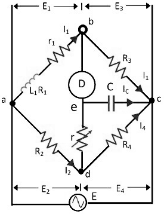

### Introduction
&nbsp;&nbsp;&nbsp;&nbsp;&nbsp;&nbsp;&nbsp;&nbsp;&nbsp;&nbsp;&nbsp;&nbsp;AC bridges are often used to measure the value of unknown impedance (self/mutual inductance of inductors or capacitance of capacitors accurately). A large number of AC bridges are available and Anderson's Bridge is an AC bridge used to measure self inductance of the coil. It is a modification of Wheatstones Bridge. It enables us to measure the inductance of a coil using capacitor and resistors and does not require repeated balancing of the bridge.The connections are shown in Fig: 1.  
&nbsp;&nbsp;&nbsp;&nbsp;&nbsp;&nbsp;&nbsp;&nbsp;&nbsp;&nbsp;&nbsp;&nbsp;The bridge is balanced by a steady current by replacing the headphone H by moving coil galvanometer and AC source by a battery. This is done by adjusting the variable resistance, r. After a steady balance has been obtained, inductive balance is obtained by using the A.C source and headphone.  
&nbsp;&nbsp;&nbsp;&nbsp;&nbsp;&nbsp;&nbsp;&nbsp;&nbsp;&nbsp;&nbsp;&nbsp;The condition for balance is that the potentials at the terminals D and E are same. Then the current flowing through branch AB is I1, through branch AE and EB is I2. The current flowing through branches AD and DC is I3, while that through branch BC is I1+I2. No current flows through branch DE. 
 

**Fig. 1**

### Note:
1.  Since the impedances of the arms should be of the same order of magnitude, the approximate value of L should be determined by some other method.
2.  Sometimes it may be impossible to obtain the balance by varying r and S. Then the formula for L with a value of RQ which satisfies formula for S may require negative value of r. If the product  CRq is greater than L, then variable resistance r will be a negative quantity. It will, therefore, not possible to obtain a balance point under such conditions. Hence it is desirable to know the value of L approximately so that CRQ is less than L. A balance is then obtained with a positive value of r.  The value of P and R should be then be adjusted  so that r is a positive quantity and a balance can be obtained by varying the value of r. To obtain balance point a cathode ray oscilloscope can be used in place of heat phone.

### Advantages:
1.  Fixed capacitor is used in terms of variable capacitor.
2.  The bridge is used for accurate determination of inductance in millimeter range.

### Disadvantages:
1.  Bridge is more complex
2.  Difficult to attain balancing condition.
