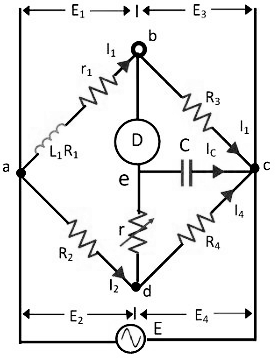

<head>

</head>

<h3>Introduction</h3>
  
The Anderson’s bridge gives the accurate measurement of self-inductance of the circuit. The bridge is the advanced form of Maxwell’s inductance capacitance bridge. In Anderson bridge, the unknown inductance is compared with the standard fixed capacitance which is connected between the two arms of the bridge.

### Construction of Anderson’s Bridge

The bridge has fours arms ab, bc, cd and ad. The arm ab consists unknown inductance along with the resistance. And the other three arms consist the purely resistive arms connected in series with the circuit.

**Fig. 1 Anderson's Bridge** 

The static capacitor and the variable resistor are connected in series and placed in parallel with the cd arm. The voltage source is applied to the terminal a and c.

Let, L1 – unknown inductance having a resistance R1. 
R2, R3, R4 – known non-inductive resistance 
C – standard capacitor

At balance Condition,

$$I_1 = I_3$$

$$I_2 = I_C + I_4$$

Now,

$$I_1R_3 = I_C × \frac{1}{jωC}$$

$$I_C = I_1jωCR_3$$

The other balance condition equation is expressed as

$$I_1(r_1 + R_1 + jωL_1) = I_2R_2 + I_Cr$$

$$I_C \left (r + \frac{1}{jωC} \right ) = (I_2 - I_C)R_4$$

By substituting the value of Ic in the above equation we get,

$$I_1(r_1 + R_1 + jωL_1) = I_2R_2 + I_1jωCR_3r$$

$$I_1(r_1 + R_1 + jωL_1 - jωCR_3r) = I_2R_2$$

and

$$I_1(R_3 + jωR_3R_4 + jωCR_3r) = I_2R_4$$

on equating the equation, we get

$$I_1(r_1 + R_1 + jωL_1 - jωCR_3r) = I_1 \left (\frac{R_1R_2}{R_3}+\frac{jωCR_3rR_2}{R_4}+jωCR_3R_2 \right )$$

Equating the real and the imaginary part, we get

$$R_1 = \frac{R_1R_3}{R_4} - r_1$$

$$L_1 = C\frac{R_3}{R_4} \left [4(R_4 + R_2) + R_2R_4 \right ]$$

### Phasor Diagram of Anderson’s Bridge

The phasor diagram of the Anderson bridge is shown in the figure below. The current I1 and the E3 are in phase and represented on the horizontal axis. When the bridge is in balance condition the voltage across the arm bc and ec are equal.

**Fig. 2  Phasor Diagram of Anderson's Bridge** 

The current enters into the bridge is divided into the two parts I1 and I2. The I1 is entered into the arm ab and causes the voltage drop I1(R1+R) which is in phase with the I1. As the bridge is in the balanced condition, the same current is passed through the arms bc and ec.

The voltage drop E4 is equal to the sum of the IC/ωC and the IC r. The current I4 and the voltage E4 are in the same phase and representing on the same line of the phasor diagram. The sum of the current IC and I4 will give rise to the current I2 in the arm ad.

When the bridge is at balance condition the emf across the arm ab and the point a, d and e are equal. The phasor sum of the voltage across the arms ac and de will give rise the voltage drops across the arm ab. The V1 is also obtained by adding the I1(R1+r1) with the voltage drop ωI1L1 in the arm AB. The phasor sum of the E1 and E3 or E2 and E4 will give the supply voltage.

### Advantages of Anderson's Bridge:
1. The balance point is easily obtained on the Anderson bridge as compared to Maxwell’s inductance capacitance bridge.
2. The bridge uses fixed capacitor because of which accurate reading is obtained.
3. The bridge measures the accurate capacitances in terms of inductances.

### Disadvantages of Anderson's Bridge:
1. The circuit has more arms which make it more complex as compared to Maxwell’s bridge. 
2. The equation of the bridge is also more complex.
3. The bridge has an additional junction which arises the difficulty in shielding the bridge.

